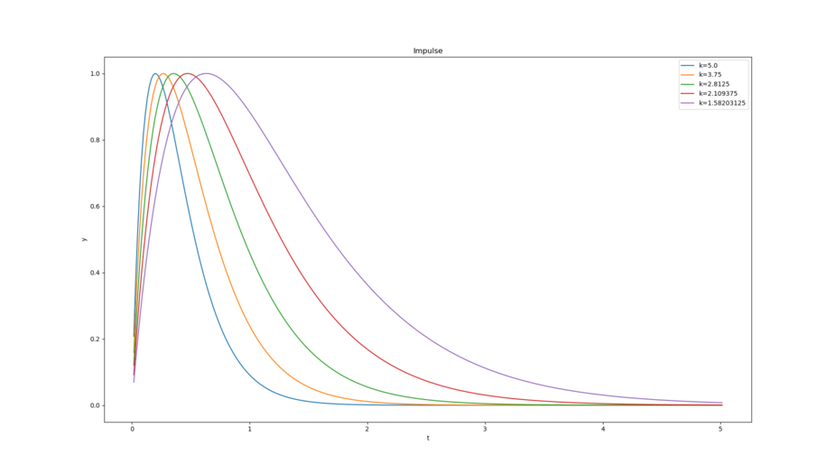
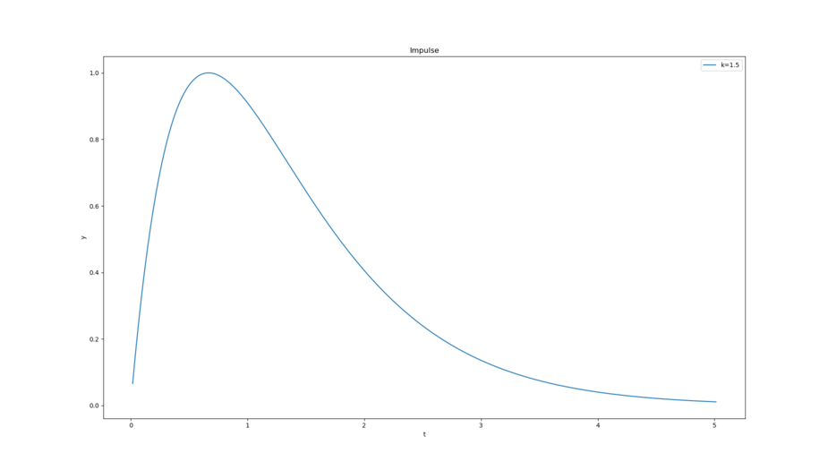
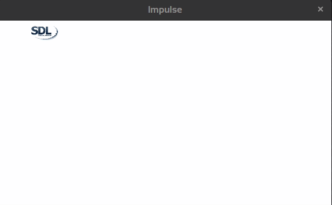

# Shaping functions in C with SDL2

In the [surfaces-series](https://github.com/Acry/SDL2-Surfaces) I did some naive linear animations and scaling. This is a demo series about non linear animations. To get more control I am gonna use floats here, now I need some non linear functions. Math provides tons of those functions. In computer graphics shaping functions are well known and used to create procedural graphics, too. But, one can use those functions also to shape the time-steps, positions or colors.

Just for getting in, `1.c` does normalized linear raise of the y-value.

## Example: Non-linear animations using the `Impulse-Function`

Grows quickly, falls off slowly.



Great for triggering behaviors or making envelopes for music or animation, and for anything that grows fast and then slowly decays.

Smaller values are looking better.

Use k to control the stretching of the function.
It's maximum, which is 1.0, happens at exactly x = 1/k.

C-Function:
```c   
float impulse( float k, float x )
{
    float h = k*x;
    return h*expf(1.0-h);
}
```

Note:
The `mathplotlib` sources in `Python 3 `for the diagrams are in the source directory.
One can use them to show the diagrams interactive or print higher resolutions.

### Implement an animation with x and y values.

The duration will be 5 seconds.
`K` is a constant  - I am going to plug 1.5 in here, so the curve should look like this:



That means that the y-value of the actor will be maxed after less than a second and slowly moves to the ground.

So `k` and `t` went into the function, returning a `float` between `0.0` and `1.0`, which was used as height in percentage. Just remember SDL's Y starts at 0 (origin top-left), so that the actual current height is:
`pos.y = max_h-y;`



## Shaping Functions

`Shaping functions`, often referred to as `easing functions` or `interpolation functions`, play a crucial role in computer graphics, including `UI/UX design`, and `game development`. They provide a way to `interpolate values in a non-linear fashion`, making `transitions` and `animations` appear more natural or dynamic.

- **Easing Functions**: As previously mentioned, these are functions that vary the speed of an animation over time.

- **Tweening**: This term stands for "in-betweening". It describes the process of generating intermediate frames between two states to produce the appearance of smooth animation. For example, if you wanted to move a point from A to B, tweening would generate the movement between those two points.

- **Interpolation Functions**: Interpolation refers to computing values between two known values. In animations, interpolation is often used to compute intermediate values required to produce movement between two states.

- **Transition Functions**: Another term occasionally used, especially within the context of user interface design and CSS.

- **Fading Functions**: This term is sometimes used, particularly when functions are specifically controlling fade in and out effects.

The concept of `tweening` originally came from traditional animation. Animators would create `keyframes`, and then `in-betweeners` would draw the frames in between to create a smooth movement. In digital animation and computer graphics, this process has taken an automated form where software generates the in-between frames based on the provided keyframes and the selected interpolation or easing function.

`Shaping functions` (also known as `Easing functions` or `Tweening functions`) are functions used to make animations appear smoother and more natural. These functions can control how the speed of an animation changes over time. Instead of a linear interpolation, where something moves uniformly from point `A` to point `B`, shaping functions allow for a movement to speed up or slow down.

Some of the most common shaping functions:

1. **Linear**:
   - Formula: $f(t) = t$
   - Description: Constant speed, no acceleration or deceleration.

2. **Ease-in (quadratic, cubic, quartic, quintic)**:
   - Formula (quadratic): $f(t) = t^2$
   - Description: Slow start, accelerating toward the end.

3. **Ease-out (quadratic, cubic, quartic, quintic)**:
   - Formula (quadratic): $f(t) = t \times (2 - t)$
   - Description: Fast start, decelerating toward the end.

4. **Ease-in-out (quadratic, cubic, quartic, quintic)**:
   - Formula (quadratic): $f(t) = t < 0.5 ? 2t^2 : -1 + (4 - 2t) \times t$
   - Description: Slow start, acceleration in the middle, deceleration toward the end.

5. **Sine**:
   - Formula: $f(t) = \sin(t \times \frac{\pi}{2})$
   - Description: Sine curve for smoother transitional animation.

6. **Exponential**:
   - Formula (Ease-in): $f(t) = 2^{10(t-1)}$
   - Description: An exponentially increasing or decreasing function.

7. **Bounce**:
   - Description: Simulates a "bounce effect", as if an object were dropping onto a surface and rebounding multiple times.

8. **Elastic**:
   - Description: An overshooting effect at the end of the animation, similar to an elastic band.

In computer graphics, and especially in user interface development and gaming, these functions are frequently used to make animations, transitions, and movements more realistic and appealing. Many graphic libraries and frameworks already offer built-in functions for these shaping functions, making it easy for developers to integrate them into their projects.

Some visualized shaping functions:


## Applications

One usage of a shaping function would be the animation speed of an object. You could apply a shaping function to the color intensity or a gradient.

Absolutely, shaping functions can be applied to various aspects of animations and transitions to create more visually appealing and dynamic effects. Here are some additional suggestions for using shaping functions:

1. **Rotation Animation**: Apply shaping functions to control the rotation speed or angle of an object. For example, you can use an ease-in function to gradually accelerate a spinning object.

2. **Scaling Animation**: Adjust the scaling rate of an object using shaping functions. This can create effects like objects smoothly growing or shrinking in size.

3. **Opacity Transition**: Control the opacity (transparency) of an object as it appears or disappears on the screen. Use shaping functions to make the fade-in or fade-out more natural.

4. **Path Following**: Apply shaping functions to control how an object follows a path. This can result in objects smoothly accelerating and decelerating along a curved trajectory.

5. **Camera Movement**: In 3D scenes, shaping functions can be used to control camera movements, such as panning or zooming, to provide a more cinematic feel.

6. **Particle Systems**: When simulating particle systems (e.g., raindrops, sparks), shaping functions can be used to control the speed, size, and opacity of individual particles.

7. **Color Transitions**: As you mentioned, shaping functions can be used to smoothly transition colors. For example, you can make a button change color with an ease-in-out effect when hovered over.

8. **Text Effects**: Apply shaping functions to text animations, such as text scaling or fading in letter by letter.

9. **User Interface Elements**: Enhance user interface interactions with shaping functions. For instance, use an elastic easing function for interactive elements like buttons to provide a tactile feel.

10. **Game Mechanics**: In game development, shaping functions can control character movement, weapon recoil, and enemy behavior, adding realism and playability.

Remember that the choice of the shaping function and its parameters (e.g., duration, intensity) depends on the specific effect you want to achieve and the mood or style you want to convey in your animation or application. Experimentation with different shaping functions is often part of the creative process to find the most suitable one for your needs.

## Fields in CG where shaping functions are used

1. **UI/UX Design**:
    - **Button Presses**: When a user presses a button, instead of instantly changing its color or size, an easing function can be used to make the transition smoother.
    - **Modal Pop-ups**: When a modal window appears or disappears, easing can make the transition appear more fluid, with the modal seeming to "spring" into place or gently fade out.
    - **Page Transitions**: When transitioning between pages or screen states, easing functions can make the animations more engaging.

2. **Game Development**:
    - **Character Movement**: For example, when a character starts running or stops, easing can be applied to make the acceleration and deceleration appear more natural.
    - **Camera Movement**: When the game camera moves to follow an object or pans across a scene, easing can make the movement feel more dynamic and less mechanical.
    - **Particle Effects**: Easing can be applied to the movement of particles, making explosions, smoke, or magic effects more visually appealing.

3. **Data Visualization**:
    - **Graph Animations**: When a bar chart or line graph updates its values, easing can make the bars or lines grow/shrink or move in a more pleasing way.
    - **Map Zoom**: When zooming in or out on a map visualization, easing can create a smoother zoom effect.

4. **Web Development**:
    - **Parallax Scrolling**: As the user scrolls, different elements on the page can move at different rates, and easing can be applied to make this movement appear more fluid.
    - **Carousel Transitions**: When sliding between images or content in a carousel, easing can be used to make the transition more engaging.
    - **Hover Effects**: Easing can be applied to make hover transitions on elements like cards, buttons, or links more visually appealing.

5. **Video and Film Production**:
    - **Motion Graphics**: Text or graphic elements that move, grow, or change in a scene can benefit from easing to appear more dynamic.
    - **Camera Pans and Zooms**: Easing can make the camera movement in a scene feel more organic.

6. **Interactive Art and Installations**:
    - Easing functions can be applied to make animations or visual transitions in response to user interaction (like touch or movement) appear more fluid and engaging.

7. **Typography**:
    - **Animated Text**: When text appears, disappears, or changes in a design or animation, easing can make the transition look smoother.

In essence, anytime there's a need to transition between two states in a visual medium, whether it's a position, size, color, or any other attribute, shaping or easing functions can be employed to make that transition appear more natural or engaging.

## Useful links

[Inigo Quilez's Graphtoy](https://graphtoy.com/) | [Inigo Quilez's useful little functions](https://www.iquilezles.org/www/articles/functions/functions.htm) | [The Book of Shaders - Chapter 5](https://thebookofshaders.com/05/) | [SDL2](https://www.libsdl.org/) / [SDL-Discourse](https://discourse.libsdl.org) | [My SDL2 Demo-Collection](https://acry.github.io/SDL2-C.html) | [Contact me](https://acry.github.io/#contact)
